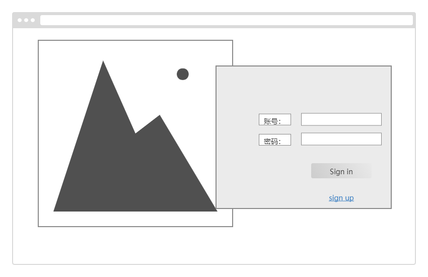
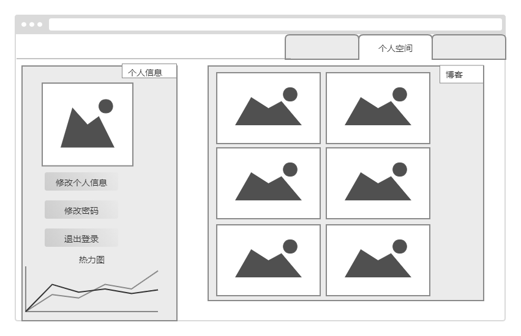
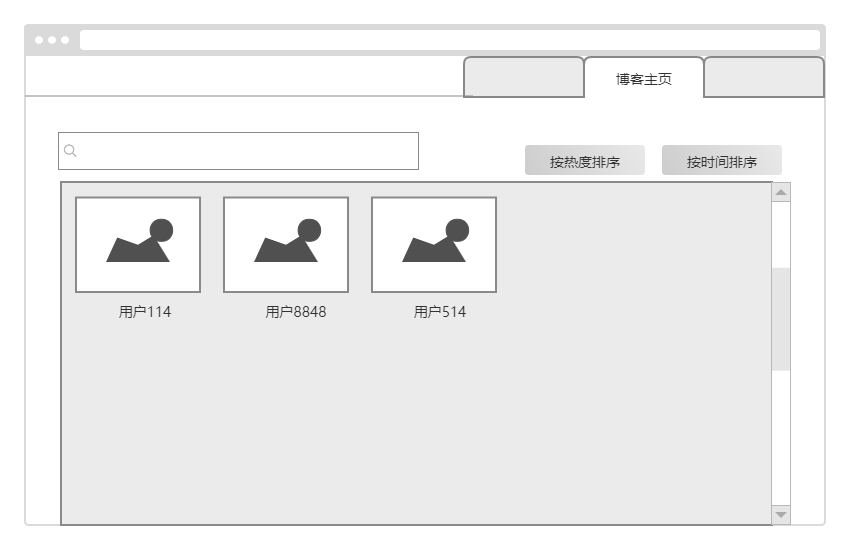
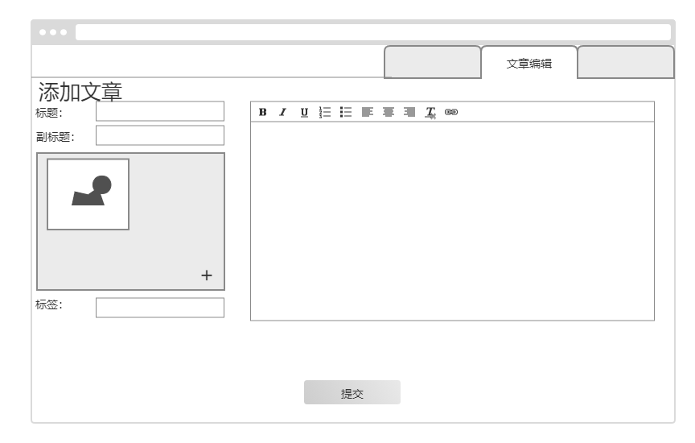
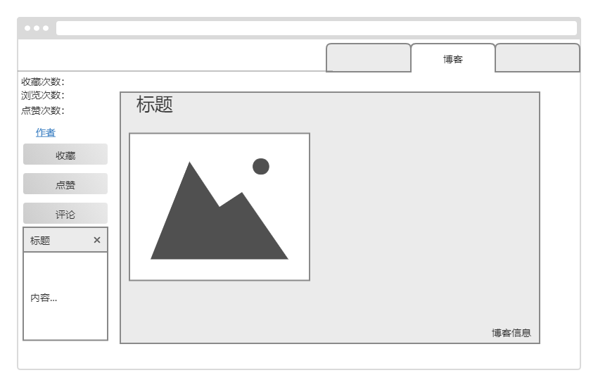

# 博客系统需求规格说明书

## 一、引言

### 1.1 编写目的

本文档编写基于以下准则:

(1) 理解并描述问题的信息域, 并以此建立数据模型.

(2) 定义软件应完成的功能, 并以此建立功能模型.

(3) 描述作为外部事件结果的软件行为, 建立行为模型.

(4) 对描述信息, 功能和行为的模型进行分解, 用层次的方式展示细节.

(5) 利于用户和开发者之间的交流, 为软件开发工作提供了基础和用于测试和验收的依据.

本文档面向多种读者对象:

(1) 项目经理: 了解预期产品的功能, 并据此进行系统设计, 项目管理.

(2) 系统分析员: 对目标系统提出完整, 准确, 清晰, 具体的要求.

(3) 设计员: 对需求进行分析, 并进行系统和功能设计, 包括数据库设计和安全设计.

(4) 程序员: 了解系统功能, 实现并优化软件功能, 编写《用户手册》.

(5) 测试员: 根据本文档编写测试用例及测试文档, 并对软件产品进行功能性测试和非功能性测试.

(6) 用户: 了解预期产品的功能和性能, 并与系统分析员一起对整个需求进行讨论和协商.

### 1.2 项目背景

A. 项目名称: RK Blog博客社交系统

B. 项目提出者: 冉康安 陈弘扬 颜塨洵 孙鹏 郭佳昊

C. 项目开发者: 冉康安 陈弘扬 颜塨洵 孙鹏 郭佳昊

D. 项目用户: 有博客社交功能需求的人

E. 项目开发单位: 武汉大学计算机学院大型应用软件课程设计大软攻坚队

F. 项目简介:

​	博客是使用特定的软件，在网络上出版、发表和张贴个人文章的人，或者是一种通常由个人管理、不定期张贴新的文章的网站。博客上的文章通常以网页形式出现，并根据张贴时间，以倒序排列。通常具备RSS订阅功能。博客是继MSN、BBS、ICQ之后出现的第4种网络交流方式，现已受到大家的欢迎，是网络时代的个人“读者文摘”，是以超级链接为入口的网络日记，它代表着新的生活、工作和学习方式。许多博客专注在特定的课题上提供评论或新闻，其他则被作为个人性的日记。一个典型的博客结合了文字、图像、其他博客或网站的链接及其它与主题相关的媒体，能够让读者以互动的方式留下意见，是许多博客的重要要素。大部分的博客内容以文字为主，但仍有一些博客专注在艺术、摄影、视频、音乐、播客等各种主题。博客是社会媒体网络的一部分。

G. 项目说明:

《RK Blog博客系统需求说明书》的目的是明确《RK Blog博客系统》中各项功能和非功能需求, 确定系统功能模块, 同时为概要设计和详细设计人员提供设计依据, 也可供本项目的其他开发人员参阅. 本需求分析报告的目的是规范化本软件的编写, 旨在于提高软件开发过程中的能见度, 便于对软件开发过程中的控制与管理, 同时提出了本博客系统的软件开发过程, 便于程序员与客户之间的交流与协作, 并作为工作成果的原始依据, 同时也表明了本软件的共性, 以期能够获得更大范围的应用.

本文档需要交于论证人员进行论证修改, 无误后供软件开发人员进行后期的软件设计.

项目在目前的阶段与其他软件和系统没有关系, 作为一个独立的单位运行.

## 二、系统需求概述

### **2.1 用户系统的用例图**

### **2.2用例的概要描述**

| 主要参与者 | 优先级 |    用例名    |                  用例概述                  |
| :--------: | :----: | :----------: | :----------------------------------------: |
|    用户    |   高   |   登录注册   |     用户通过登录页面进行登录或注册操作     |
|    用户    |   高   |   个人信息   | 用户通过个人主页查看用户名/昵称或修改昵称  |
|    用户    |   高   | 个人博客仓库 |   用户在个人博客仓库中检索自己发布的博客   |
|    用户    |   高   |  关注的作者  | 用户通过个人主页查看自己关注的其他博客作者 |
|    用户    |   中   |    热力图    |     用户通过个人主页查看自己的日活度图     |
|    用户    |   低   |   历史记录   | 用户通过个人主页查看自己的博客浏览历史记录 |
|    用户    |   高   |   模糊搜索   |   用户通过博客主页搜索其他用户或其他文章   |
|    用户    |   中   |   博客排序   |      用户通过博客主页查看所有博客排行      |
|    用户    |   高   |   增加文章   |         用户通过文章编辑器新建文章         |
|    用户    |   高   |   删除文章   |    用户通过文章编辑器永久删除发布的文章    |
|    用户    |   高   |   修改文章   |         用户通过文章编辑器修改文章         |
|    用户    |   高   |   收藏文章   |  用户可以在浏览其他文章时收藏文章至收藏夹  |
|    用户    |   高   |   浏览文章   |         用户可以浏览完整的文章博客         |
|    用户    |   高   |   关注作者   |  用户可以在浏览其他文章时关注该文章的作者  |
|    用户    |   低   |     点赞     |     用户可以在浏览其他文章时对文章点赞     |
|    用户    |   低   |     评论     |   用户可以在浏览其他文章时对文章发表评论   |

### 2.3假设与依赖

1.用户必须具备基本的计算机知识

2.用户发表博客必须遵守基本的道德法规

## 三、功能需求

博客系统主要有登录注册、编辑个人信息、浏览博客，编辑文章、博客社交五个功能

### 3.1 登录注册功能

用户在网站首页需要先登录或注册账号才能进入博客空间

1.无账号用户：在登录页面点击Sign up链接进入注册页面→新建账号和密码并确认密码→点击Sign up进行注册→成功之后跳转人博客空间

2.有账号用户：在登录页面输入账号和密码→点击Sign in按钮→成功之后跳转人博客空间

### 3.2 编辑个人信息功能

用户可以在首页点击个人空间进入个人博客空间，在个人博客空间中浏览自己发布的博客或者修改个人信息，可以修改昵称、密码和密码。

### 3.3 浏览博客

用户可以在博客主页随机浏览博客或者对博客或作者进行搜索，还可以按时间顺序或热度顺序检索博客。

### 3.4 编辑文章

用户可以在个人主页中点击文章编辑器来新建、修改、删除文章。

### 3.5 博客社交

用户可以在浏览其他博客时对博客收藏关注点赞和评论。

## 四、非功能需求

### 4.1 安全性

| 需求分类 | 定义要素       |                           需求内容                           |
| -------- | -------------- | :----------------------------------------------------------: |
| 系统安全 | 安全机制独立性 | 安全设计和实现应该具有独立性, 不能依赖当前主机的基础安全机制来确保自身和数据不受破环或拒绝服务. |
| 系统安全 | 安全机制有效性 |    应防止用户绕过其安全控制机制直接尝试访问系统各项功能.     |
| 系统安全 | 访问权限       |       对未登录的ghost用户的访问权限进行严格的访问控制,       |
| 系统安全 | 输入限制       |      具备输入字符和输入数据的类型, 长度和范围检查功能.       |
| 系统安全 | 防止SQL注入    |                    系统应没有SQL注入情况.                    |
| 系统安全 | 权限初始化     |               用户的权限应该符合最小权限原则.                |
| 系统安全 | 异常事件       | 应该定义了分级的系统异常事件, 并且根据异常的严重程度分别采用日志记录, 警告提示等方式进行通知. 对部分严重故障自动处理, 使学生信息系统恢复正常状态或保护现存数据安全. |
| 系统安全 | 安全日志系统   | 所有的系统出错信息都必须被记录到出错日志中, 信息的格式必须是系统错误号码, 日期, 时间, 错误信息. 和用户相关的每个页面迁移信息都必须被记录到追寻日志中. 信息的格式必须是用户帐号, 日期, 时间, 迁移的页面名. 每次处理前后的消耗的内存和处理时间都必须被记录到性能日志中. 信息的格式必须是日期、时间, 消耗的内存, 处理时间. |
| 系统安全 | 安全系统       | 安全系统必须拦截非法的访问, 和对网站的恶意进攻包括 (XSS , SQL Injection, 非法盗链等, 非法字符输入等). |
| 数据安全 | 数据完整性     | 能够检测到网络设备操作系统, 主机操作系统, 数据库管理系统以及学生信息系统的重要业务数据在传输过程中完整性受到破坏. |

### 4.2 易用性

| 需求分类     | 定义要素                                                     |                           需求内容                           |
| ------------ | ------------------------------------------------------------ | :----------------------------------------------------------: |
| 用户界面     | 界面风格要求                                                 | 提供一致性的图形用户界面风格; 系统的客户端必须是 Web 浏览器, 不需要安装额外的软件.同时, 用户界面设计必须简单明了, 不需要乘客花费额外的时间来学习. |
| 界面导航要求 | 功能菜单必须按照功能模块, 功能项的分类方法进行组织;          |      每个模块相互分隔, 逻辑功能尽可能保持较小的冗余度.       |
| 界面输入要求 | 操作界面必须明确表示出必填的输入信息.                        | 每个可能的输入都有确定的返回值, 如果出现异常会及时报错并提供正确的帮助信息. |
| 界面提示要求 | 发现用户提交有误信息, 必须以弹出窗口的形式明确提示用户错误的原因, 并把界面控制焦点置于发生错误的控件对象上; 在导致数据发生变化的操作执行之前, 应该弹出提示窗口供用户确认 | 博客系统的每个重要页面上必须都有相关的帮助页面的链接, 乘客可以使用它们来获得必要的帮助信息. |

### 4.3 可靠性

**▶ 可用性**

博客系统必须能够24小时*7天的工作.

**▶ 系统发生严重错误的平均时间间隔**

后台系统发生严重错误的平均时间间隔应该大于3000小时

### 4.4 性能

**▶ 最大的并发人数**

博客系统的最大并发访问数应该为500. 在这个范围内, 系统应该能够很好的工作.

**▶ 最大系统响应时间**

在最大并发数为500范围内时, 系统对用户的最大相应时间应该小于10秒/1000条数据.

**▶ 最大的事务处理时间**

博客系统的用户事务的最大处理时间是30秒, 如果超过这个时间系统应该自动结束用户的事务处理.

**▶ 单次的事务处理时间**

博客系统单次响应时间最大为3秒, 网页刷新响应在正常网速下要求低于30毫秒.

## 五、运行环境规定（待填）

**▶ 数据库管理软件**

**▶ Web 服务器软件**

**▶ 平台要求**

**▶ Web 浏览器**

## 六、验收验证标准

### 6.1 界面验收标准

| 序号 | 界面名称         |                      界面描述及预期效果                      |
| ---- | ---------------- | :----------------------------------------------------------: |
| 1    | 登录界面         | 显示输入用户名输入框, 密码输入框, 确认登录按钮，选择注册链接 |
| 2    | 注册界面         | 显示输入用户名输入框，密码输入框，密码确认输入框，确认注册按钮，选择登录链接 |
| 3    | 用户信息界面     | 显示用户头像，用户昵称，编辑信息按钮，修改密码按钮，退出登录按钮，用户博客，文章编辑按钮，tab选择按钮 |
| 4    | 用户信息编辑界面 |  显示上传头像按钮，确认修改按钮，取消修改按钮，修改密码按钮  |
| 5    | 搜索界面         |            显示搜索输入框，tab选择按钮，搜索按钮             |
| 6    | 博客页面主页面   |  显示博客信息，tab选择按钮，按时间排序按钮，按热度排序按钮   |
| 7    | 单个博客具体页面 | 显示文章标题，文章副标题，文章作者，浏览次数，收藏次数，点赞次数，发布信息，博客具体内容页面 |
| 8    | 文章编辑界面     | 显示文章标题输入框，文章副标题输入框，背景图片选择上传按钮，标签添加按钮，文本编辑器，确认修改按钮 |
| 9    | 修改密码界面     |  显示原密码输入框，新密码输入框，确认修改按钮，取消修改按钮  |

### 6.2 功能验收标准

| 序号 | 功能名称         | 详细操作                                                     | 预期效果                                                     |
| ---- | ---------------- | ------------------------------------------------------------ | ------------------------------------------------------------ |
| 1    | 登录账号         | 输入用户名, 密码，点击登录按钮                               | 成功登录账号并弹窗通知, 跳转至博客首页                       |
| 2    | 注册账号         | 输入用户名，密码，确认密码，点击注册按钮                     | 成功注册账号并弹窗通知, 跳转至博客首页                       |
| 3    | 选择登录注册     | 在登录界面点击注册，在注册界面点击登录                       | 成功跳转至注册界面和登录界面                                 |
| 4    | 个人主页         | 点击个人博客空间tab按钮                                      | 成功跳转至个人博客空间                                       |
| 5    | 编辑信息         | 点击编辑信息按钮                                             | 成功跳转至信息编辑界面                                       |
| 6    | 修改头像         | 点击修改头像按钮，进入图片选择框，上传新头像                 | 成功修改头像并显示                                           |
| 7    | 修改昵称         | 在昵称输入框输入新昵称并点击保存                             | 成功修改昵称并显示                                           |
| 8    | 修改密码         | 点击修改密码，输入原密码和新密码并点击确认                   | 成功修改密码并重新进入登录界面                               |
| 9    | 个人博客         | 点击按时间排序按钮和热度排序按钮                             | 个人发布的博客按照时间顺序排序显示/按照热度顺序排序显示      |
| 10   | 进入编辑文章界面 | 点击添加文章按钮                                             | 成功进入文章编辑界面                                         |
| 11   | 编辑文章         | 在标题栏输入标题，在副标题栏输入副标题，在背景图片栏点击添加图片并选择图片上传，在文章内容编辑器中输入文章内容，点击上传文章按钮 | 成功上传博客并在个人博客空间中检索到                         |
| 12   | 搜索博客         | 点击搜索tab按钮                                              | 成功进入搜索页面                                             |
| 13   | 搜索功能         | 在搜索框输入信息，点击搜查                                   | 成功显示搜索结果博客                                         |
| 14   | 博客主页         | 点击博客主页tab按钮                                          | 成功进入博客主页并显示其他博客信息                           |
| 15   | 浏览博客         | 点击博客选取区域                                             | 成功进入博客浏览页面，显示博客信息                           |
| 16   | 社交功能         | 点击收藏按钮，点击点赞按钮，点击关注按钮                     | 成功收藏博客至收藏夹；成功点赞，并显示博客点赞数+1；成功关注博客作责 |
| 17   | 排序功能         | 在博客主页点击按时间排序按钮和按热度排序按钮                 | 成功显示排序结果                                             |

## 七、团队分工
